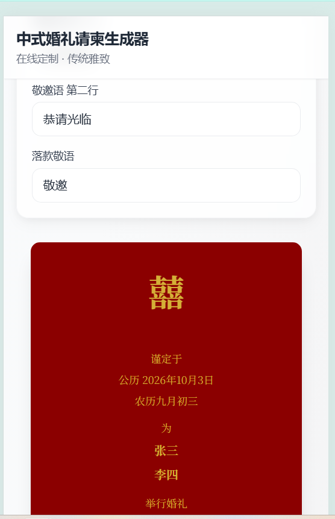

# 中式婚礼请柬生成器

> 专注中式传统婚礼的在线请柬生成器，支持多模板、云端保存与分享链接。

[](.)
[](https://react.dev/)
[](https://www.typescriptlang.org/)

---

## ✨ 功能特性

- **四种模板风格**：古典传统、红金对称、祥云边框、竖排中式
- **在线编辑**：新郎新娘、日期、地点、敬邀语等一键填写
- **云端保存**：请柬数据持久化，支持分享链接
- **实时预览**：编辑即预览，所见即所得
- **姓名字体**：支持宋体、仿宋、楷体、隶书等传统字体

---

## 📸 模板展示

### 红金对称
深红底、金色文字，经典囍字居中，适合喜庆庄重场合。


### 竖排中式
传统竖排书写，柬请、送呈、台启等格式完整，典雅大气。


### 祥云边框
白底红边，祥云装饰，清新雅致。



---

## 🚀 快速开始

### 原版（Vite + Spring Boot）

```bash
# 安装依赖
pnpm install

# 启动前端（需同时启动 invitation-card-api 后端，端口 8089）
pnpm run dev
```

### Next.js 全栈版

```bash
cd invitation-card-next
pnpm install
cp .env.example .env   # 配置 DATABASE_URL
pnpm prisma generate
pnpm dev
```

访问 http://localhost:3000

---

## 📁 项目结构

| 目录 | 说明 |
|------|------|
| `src/` | 前端：React + Vite + TypeScript，部署到 GitHub Pages |
| `invitation-card-api/` | 后端：Spring Boot + MySQL |
| `invitation-card-next/` | **Next.js 全栈版**：前端与 API 一体化，Prisma + MySQL |

---

## 🛠 技术栈

| 版本 | 前端 | 后端 | 数据库 |
|------|------|------|--------|
| 原版 | React 18、Vite、TailwindCSS | Spring Boot 2.2、JPA | MySQL |
| Next.js 版 | Next.js 14、React、TailwindCSS | Next.js API Routes | MySQL + Prisma |

---

## 📦 构建与部署

- **原版**：`pnpm build`，推送到 `main` 后 GitHub Actions 自动部署到 GitHub Pages
- **Next.js 版**：`pnpm build && pnpm start`，可部署到 Vercel、自建服务器等

---

## 📄 License

MIT
